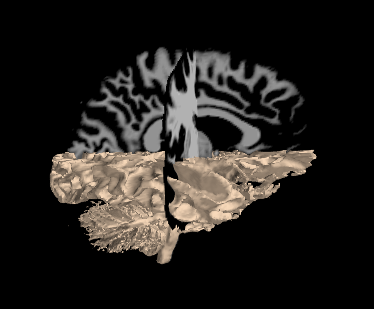

# Connectomes of Schizophrenic and Healthy Individuals

I investigate an fMRI dataset comparing healthy individuals to individuals
diagnosed with schizophrenia. The current belief is that connectivity between
functional components is significantly different in individuals with (or
susceptible to) schizophrenia. There are two main motivations for this project.

The first is to look for functioning neurological processes that may
indicate illness or susceptibility to illness -- schizophrenia, in our case.
I analyze fMRI data by constructing graph networks representing region
connectivity/correlation. I then investigate *which graph network
features are the most important predictors*. The most important predictors
will have the most impact on improving the accuracy of classification or
clustering of individuals.

The second motivation is to create data-driven visualization and
presentation of such neuroscience results. This is demonstrated in the
present report and the companion web application [link].



## Results

Here is a plot of the graph network connectome of patient 'sub001', using
the MSDL brain atlas.  The boldness of the red lines indicates the strength
of correlation, whereas the blue lines indicate anticorrelation.


## Running

You will need to download the data and either extract to a 'data' folder
in the current directory, or change the locations in the scripts.

Once this is done, please follow the commands below to run the main scripts to
reproduce the results.

To generate the EDA figures:
```
	python run_eda.py
```

To explore the metadata and generate stats:
```
	python run_metadata_model.py
```

To fit the fMRI model and generate corresponding figures -- this may take a
while, since the files are large and there is quite a bit of processing:
```
	python run_graph_model.py
```

To run the web app:
```
	python run_web_app.py
```

### Requirements

#### Python (2.7)

* Pandas -- Data manipulation (e.g. demographics.txt)
* NewtorkX -- Graph network package.
* Scikit-learn -- Machine learning in python.
* NiBabel -- Working with NIfTI files.
* Nilearn -- Machine learning for neuroscience data.
* NiPy -- Neuroscience data manipulation tools in python.
* Nipype -- Interface with existing neuroscience software (e.g. SPM, FSL).
* Matplotlib -- Generic 2D plotting and animations.
* Mayavi -- 2D/3D visualization.

#### R (3.3.2)

* TDA -- Topological data analysis package.

#### Programs

* FSL

## Data

For detailed description of the data I suggest looking at this project docs
[link(s)].

The data are located at https://openfmri.org/dataset/ds000115/ [3].

The AWS hosted files consist of raw fMRI images for 102 patients in addition
to many preprocessed derivatives (processed with FSL).  The data comes with
an interesting 'demographics.txt' file, providing additional data for most of
the subjects.

The data present two distinct challenges:

* Unfortunately the authors of the dataset have not also published the resting
  state data. This makes it difficult/impossible to separate resting state
  activity from task-based activity.
* The dataset is actually small.  There are only 102 samples. But the data
  are also big -- there are 49 columns of data in 'demographic.txt' in addition
  to the fMRI which is 3 (tests) * (64 * 64 * 36) (spatial) * 137 (temporal)
  = 20201472 or about 10^7 'features'.  *Of course, we hope to extract only a
  few meaningful features from all of those*.


## References
[1] http://www.ncbi.nlm.nih.gov/pmc/articles/PMC3358772/

[2] http://www.ncbi.nlm.nih.gov/pubmed/21193174

[3] This data was obtained from the OpenfMRI database. Its accession number is ds000115

## Acknowledgments
I would like to thank the investigators for making the data publicly available:

* Barch DM
* Repovs G
* Csernansky JG

I would also like to thank the creators of Nilearn, for making a wonderful
piece of well-documented software.
