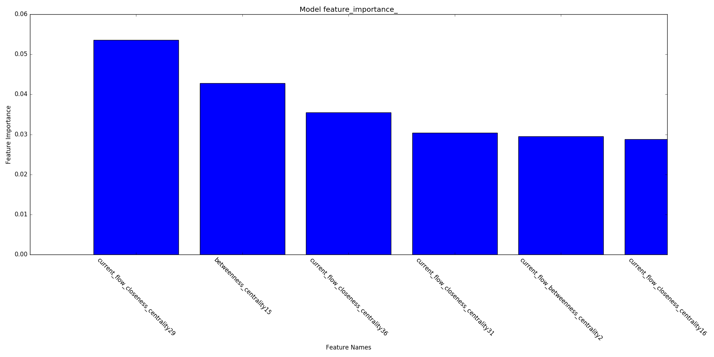

[]()
 
[]()

# Connectomes of Schizophrenic and Healthy Individuals

I investigate an fMRI dataset comparing healthy individuals to those
diagnosed with schizophrenia. The current belief is that connectivity between
functional components is significantly different in individuals with (or
susceptible to) schizophrenia[1]. There are two main motivations for this
project.

The first is to look for functioning neurological processes that may
indicate illness or susceptibility to illness -- schizophrenia, in our case
-- using the dataset from references [1,3].
I analyze the fMRI data by constructing graph networks representing region
connectivity/correlation. I then investigate *which graph network
features are the most important predictors*. The most important predictors
will have the most impact on improving the accuracy of classification or
clustering of individuals.

The second motivation is to create data-driven visualization and
presentation of such neuroscience results. This is demonstrated in the
present report and the companion web application
[sConnectome](http://ec2-54-146-103-117.compute-1.amazonaws.com:8080).


## Results

First I processed the data into standard form, for comparison/aggregation
of subject data across tasks (or even across different subjects).
For more details on the analysis, please see [Analysis](docs/Analysis.md).
The following is a slice of fMRI for 'sub001' in MNI coordinates:

.


Next I filtered the subject data into MSDL brain atlas regions, in order to
compute correlations between a manageable number of regions. This matrix
can be thought of as a 'connectome', one for each subject.
Below is a plot of the connectome for subject 'sub001'.
The boldness of the red lines indicates the strength
of correlation, whereas the blue lines indicate anticorrelation.


I then used NetworkX to extract graph features from all subject connectomes,
paired with the labeled data from 'demographics.txt', to be piped into
Scikit-Learn, for classification.  I attempt to classify schizophrenic/healthy,
in addition to schizophrenic/(healthy)schizophrenic's sibling/heathy.

The model is not predictive at this stage, however, for demonstration
purposes, we can ask "What are the important graph features?"  This can
be shown on a feature importance plot:



This sort of analysis has potentially interesting implications.  For example,
the above graph says that 'current flow closeness centrality' of region 29,
which corresponds to brain region 'Sup Front S', is one of the most important
features for distinguishing schizophrenia. This could be important for
understanding, diagnosing, and treating schizophrenia.

For future analysis, I am looking forward to performing signal/noise analysis,
and other preprocessing, to see if I can make the model predictive.

Finally, I have compiled these results into an interactable web application:
[sConnectome](http://ec2-54-146-103-117.compute-1.amazonaws.com:8080)

## Data

For detailed description of the data I suggest looking at this project docs
([Directory Structure](docs/Directory_Structure.md) and
[Data Description](docs/Data_Description.md)).

The data are located at [3].

The AWS hosted files consist of raw fMRI images for 102 patients in addition
to many preprocessed derivatives (processed with FSL).  The data comes with
an interesting 'demographics.txt' file, providing additional data for most of
the subjects.

The data present two distinct challenges:

* Unfortunately the authors of the dataset have not also published the resting
  state data. This makes it difficult/impossible to separate resting state
  activity from task-based activity.
* The dataset is actually small.  There are only 102 samples. But the data
  are also big -- there are 49 columns of data in 'demographic.txt' in addition
  to the fMRI which is 3 (tests) * (64 * 64 * 36) (spatial) * 137 (temporal)
  = 20201472 or about 10^7 'features'.  *Of course, we hope to extract only a
  few meaningful features from all of those*.


## References
[1] http://www.ncbi.nlm.nih.gov/pmc/articles/PMC3358772/

[2] http://www.ncbi.nlm.nih.gov/pubmed/21193174

[3] This data was obtained from the OpenfMRI database. Its accession number is ds000115. https://openfmri.org/dataset/ds000115/

## Acknowledgments
I would like to thank the investigators for making the data publicly available:

* Barch DM
* Repovs G
* Csernansky JG

I would also like to thank the creators of Nilearn, for making a wonderful
piece of well-documented software.

## Running

You will need to download the data and either extract to a 'data' folder
in the current directory, or change the locations in the scripts. Once this is
done, please follow the commands below to run the main scripts
**to reproduce the results**.

To test the code, do the following:
```
	python run_tests.py
```

To generate the EDA figures:
```
	python run_eda.py
```

To explore the metadata and generate stats:
```
	python run_metadata_model.py
```

On AWS NeuroDebian (ami-bffb65a8) run the following -- it will take quite
a while since 'generate_graphs' is preprocessing and saving the MNI files,
and then fitting the GroupSparseCovarianceCV:
```
	python scripts/scrape_web_data.py
	cd data/; tar -zxvf *; cd ../
	python scripts/generate_graphs.py
	python scripts/generate_stat_map_plots.py
	python scripts/generate_connectome_plots.py
```

Once the 'data/graphs' and 'data/dataframes' are created, run

```
	python run_graph_model.py
```

To run the web app:
```
	python run_web_app.py
```

### Requirements

#### Python (2.7)

* Pandas -- Data manipulation (e.g. demographics.txt)
* NewtorkX -- Graph network package.
* Scikit-learn -- Machine learning in python.
* NiBabel -- Working with NIfTI files.
* Nilearn -- Machine learning for neuroscience data.
* NiPy -- Neuroscience data manipulation tools in python.
* Nipype -- Interface with existing neuroscience software (e.g. SPM, FSL).
* Matplotlib -- Generic 2D plotting and animations.
* Mayavi -- 2D/3D visualization.
* Flask, Jinja2 -- Web app framwork.
* Plot.ly -- Web visualization.
* bs4 -- BeautifulSoup
* coverage
* coverage-badge

#### Programs

* FSL
