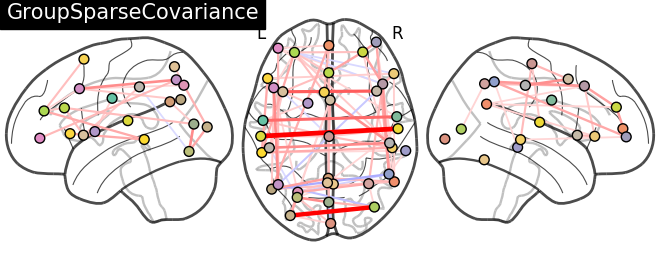

# Connectomes of Schizophrenic and Healthy Individuals

I investigate an fMRI dataset comparing healthy individuals to individuals
diagnosed with schizophrenia. The current belief is that connectivity between
functional components is significantly different in individuals with (or
susceptible to) schizophrenia. There are two main motivations for this project.

The first is to look for functioning neurological processes that may
indicate illness or susceptibility to illness -- schizophrenia, in our case.
I analyze fMRI data by constructing graph networks representing region
connectivity/correlation. I then investigate *which graph network
features are the most important predictors*. The most important predictors
will have the most impact on improving the accuracy of classification or
clustering of individuals.

The second motivation is to create data-driven visualization and
presentation of such neuroscience results. This is demonstrated in the
present report and the companion web application [link].

## Results

Here is a plot of the graph network connectome of patient 'sub001', using
the MSDL brain atlas.  The boldness of the red lines indicates the strength
of correlation, whereas the blue lines indicate anticorrelation.

## Methods

I outline some of the techniques used to perform the analysis.  For more detail,
have a look at the code!
The packages and programs (requirements) used for the analysis are listed at
the end of this section. These are required to redo the analysis.

### Metadata Analysis

#### Preprocessing

First I loaded the data into Pandas and used mean imputation to fill in NaN
fields. I have yet to implement KNN method to fill in values and I still need
to cross validate.

#### Model

I used a gradient boosting classifier from Scikit-learn on a stratified
train-test split to classify and predict.  I considered two situations:

1. Binary classification: 'SCZ' versus not 'SCZ' labeled data
2. Multiclass: Four classes {'SCZ', 'SCZ-SIB', 'CON', 'CON-SIB'}.

### fMRI Analysis

### Preprocessing

I have not done much more preprocessing than was implemented in the original
FSL pipeline -- FEAT, FLIRT, FNIRT.  

### Modeling

#### Python (2.7)

* Pandas -- Data manipulation (e.g. demographics.txt)
* NewtorkX -- Graph network package.
* Scikit-learn -- Machine learning in python.
* NiBabel -- Working with NIfTI files.
* Nilearn -- Machine learning for neuroscience data.
* NiPy -- Neuroscience data manipulation tools in python.
* Nipype -- Interface with existing neuroscience software (e.g. SPM, FSL).
* Matplotlib -- Generic 2D plotting and animations.
* Mayavi -- 2D/3D visualization.

#### R (3.3.2)

* TDA -- Topological data analysis package.

#### Programs

* FSL

## Data

For detailed description of the data I suggest looking at this project docs
[link(s)].

The data are located at https://openfmri.org/dataset/ds000115/ [3].

The AWS hosted files consist of raw fMRI images for 102 patients in addition
to many preprocessed derivatives (processed with FSL).  The data comes with
an interesting 'demographics.txt' file, providing additional data for most of
the subjects.

The data present two distinct challenges:

* Unfortunately the authors of the dataset have not also published the resting
  state data. This makes it difficult/impossible to separate resting state
  activity from task-based activity.
* The dataset is actually small.  There are only 102 samples. But the data
  are also big -- there are 49 columns of data in 'demographic.txt' in addition
  to the fMRI which is 3 (tests) * (64 * 64 * 36) (spatial) * 137 (temporal)
  = 20201472 or about 10^7 'features'.  *Of course, we hope to extract only a
  few meaningful features from all of those*.

## References
[1] http://www.ncbi.nlm.nih.gov/pmc/articles/PMC3358772/

[2] http://www.ncbi.nlm.nih.gov/pubmed/21193174

[3] This data was obtained from the OpenfMRI database. Its accession number is ds000115

## Acknowledgments
I would like to thank the investigators for making the data publicly available:

* Barch DM
* Repovs G
* Csernansky JG

I would also like to thank the creators of Nilearn, for making a wonderful
piece of well-documented software.
